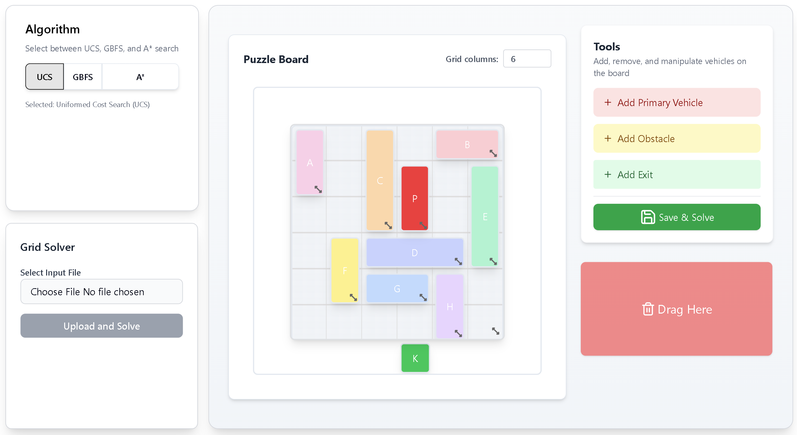

# Rush Hour Puzzle Solver

> Tugas Kecil 3 IF2211 Strategi Algoritma – Penyelesaian Puzzle Rush Hour Menggunakan Algoritma Pathfinding

<h1 align="center">🚗 Rush Hour Puzzle Solver</h1>

<p align="center">
    
</p>

<div align="center">
  <h1>KELUARIN MOBIL MERAHHHH!!! 🗣️🔥</h1>
  <i>Pilih algoritma, heuristic, dan konfigurasikan papan permainan. Biarkan program menyelesaikan puzzle untukmu.</i>
  <br>
  <b>Dikembangkan dengan ❤️ untuk IF2211 Tucil 3.</b>
</div>

---

## 🌟 Features

-   **Search Algorithms**: Implementasi UCS, Greedy Best-First Search (GBFS), dan A\* Search untuk menyelesaikan puzzle
-   **Heuristik Bonus**: Gunakan satu atau lebih heuristic yang dapat dipilih pengguna
-   **Visualisasi Pergerakan Mobil**: Input papan secara langsung, lihat langkah-langkah pergerakan mobil secara otomatis
-   **Web-based Interface**: Fleksibel dan modern dengan drag-and-drop resizable grid layout
-   **Statistic Output**: Tampilkan jumlah node yang dikunjungi dan waktu eksekusi
-   **Output File**: Test cases di folder `test` dan output save di 'test/output.txt'

<p align="left">
    <a href="https://www.javascript.com/">
        
    </a>
    <a href="https://nextjs.org/">
        
    </a>
    <a href="https://tailwindcss.com/">
        
    </a>
    <a href="https://gridstackjs.com/">
        
    </a>
</p>

---

## 📥 How to Run

### 🔧 Prerequisites

### 1. Clone the Repository

```bash
git clone https://github.com/lynaten/Tucil3_13523142_13523148.git
cd Tucil3_13523142_13523148
```

Or download the source code (.zip) from the [latest release](https://github.com/lynaten/Tucil3_13523142_13523148/releases/latest), and then you can extract it, and open the extracted folder in your terminal

### 2 . Install NPM packages

```sh
npm install
```

### 3. Run the app

```sh
npm run dev
```

---

## 🚧 Room for Improvement

-   Reoptimize the search algorithms for faster performance
-   Add extra search algorithms
-   Better UI/UX and responsive design

```
Tucil3_13523142_13523148/
├── README.md
├── test/
├── components.json
├── eslint.config.mjs
├── next.config.mjs
├── package.json
├── postcss.config.mjs
├── src/
│   ├── app/
│   │   ├── _components/
│   │   │   ├── AlgoPicker.jsx
│   │   │   ├── Block.jsx
│   │   │   ├── GridDemoPage.jsx
│   │   │   ├── Gridstack.jsx
│   │   │   └── Gridstackinner.jsx
│   │   ├── api/
│   │   │   ├── parse/
│   │   │   │   └── route.js
│   │   │   └── solve/
│   │   │       └── route.js
│   │   ├── layout.jsx
│   │   └── page.jsx
│   ├── components/
│   │   └── ui/
│   │       ├── toggle-group.jsx
│   │       └── toggle.jsx
│   ├── lib/
│   │   ├── grid-stack/
│   │   │   ├── component-map.jsx
│   │   │   ├── grid-stack-context.jsx
│   │   │   ├── grid-stack-provider.jsx
│   │   │   ├── grid-stack-render-context.jsx
│   │   │   ├── grid-stack-render-provider.jsx
│   │   │   ├── grid-stack-render.jsx
│   │   │   ├── grid-stack-widget-context.js
│   │   │   └── utils.js
│   │   └── rush-hour/
│   │       ├── Game.js
│   │       ├── extractor.js
│   │       ├── fromGridStack.js
│   │       ├── main.js
│   │       ├── node.js
│   │       └── parser.js
│   ├── styles/
│   │   ├── globals.css
│   │   └── gridstackreact.css
└── tailwind.config.js
```

---

## 🪪 Authors

| NIM      | Nama                |
| -------- | ------------------- |
| 13523142 | Nathanael Rachmat   |
| 13523148 | Andrew Tedjapratama |
